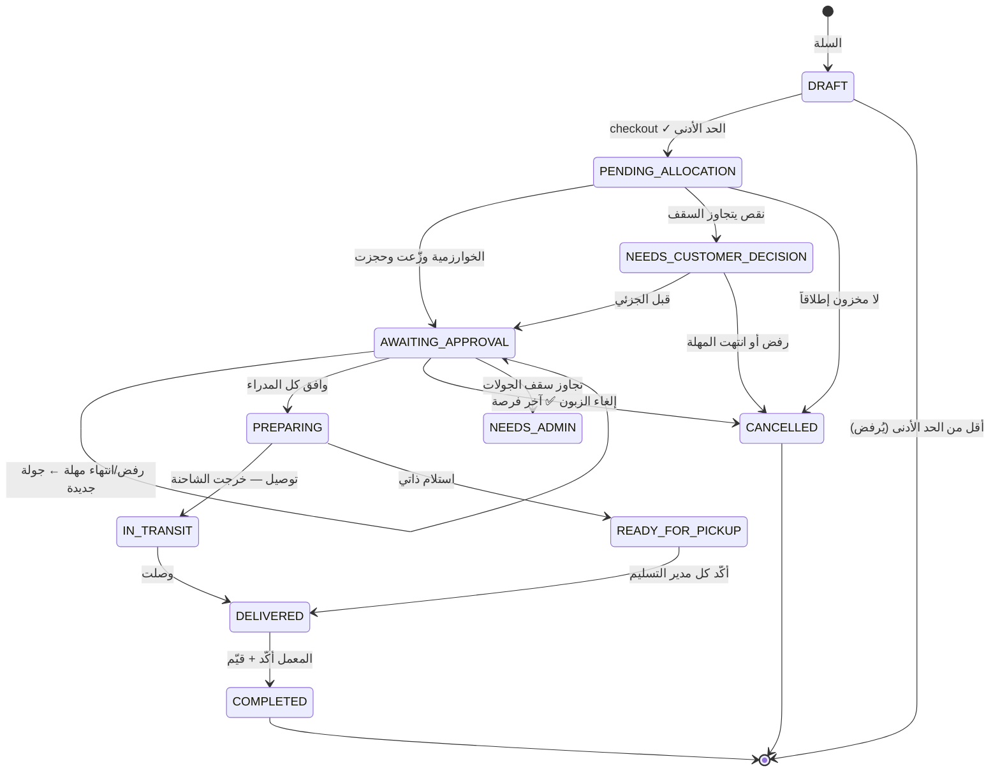

# سيناريو طلبيات المعامل والجهات الحرة — تصميم تفصيلي

> وثيقة تصميم، لا كود. مبنية على **ما هو موجود فعلاً** بالمشروعين بعد فحصهما، لا على افتراضات.
> التاريخ: 2026-07-27 · مكمّلة لـ [PROJECT_LOG.md](PROJECT_LOG.md)

---

## 0) نقطة البداية: ما هو موجود وما هو ناقص

فحصت الطرفين قبل التصميم. النتيجة تغيّر شكل الحل جذرياً — **نصف السيناريو مبنيّ أصلاً بأودو**، والناقص هو نصف الباك ايند وحلقة الوصل.

### موجود بأودو (`recycle_warehouse`)

| المكوّن | الحالة |
|---|---|
| `recycle.order` مربوطة بمستودع واحد + `backend_factory_id` + `order_type` (factory / free_facility) | ✅ |
| موافقة مدير المستودع: `manager_approval` + `action_manager_approve` / `action_manager_reject(reason)` + من قرّر ومتى وسبب الرفض | ✅ **هذا بالضبط ما طلبته** |
| موظف الإخراج: `action_start_processing` → `action_complete(allocations)` (خصم من مناطق محددة + توليد فاتورة) → `action_finish(output_zone_id)` | ✅ |
| سجل حركة لكل خصم: `recycle.order.zone.movement` (المنطقة، المادة، الحالة، الكمية، من خصم، متى) | ✅ **السجل الزمني الذي طلبته** |
| `mail.thread` على الطلبية → تتبّع تلقائي لكل تغيير حالة | ✅ |
| طابور أولويات: `priority` + `get_blocking_order()` | ✅ |
| `recycle.province` + `warehouse.province_id` | ✅ (بُني اليوم) |
| مرآة المخزون تُدفَع للباك ايند عبر `SYNC_WAREHOUSE` | ✅ |

### ناقص — وهذا هو نطاق العمل الحقيقي

| # | الناقص | الخطورة |
|---|---|---|
| 1 | **لا كيان `Order` بالباك ايند إطلاقاً** — يوجد `Cart` + `CartItem` فقط | 🔴 جوهري |
| 2 | **لا مستقبِل لـ `/webhooks/odoo/orders`** — أودو يرسل (`backend_sync.sync_order`) ولا أحد يستمع، فكل طلبية تكتمل بأودو تضيع بصمت | 🔴 **عطل قائم الآن** |
| 3 | **لا حجز مخزون** — `recycle.stock` بلا `reserved_qty`، و`fetchWarehouseInventory` يقرأ `quantity` فقط، فعمود `WarehouseInventory.reservedQuantity` بالباك ايند **ميت (صفر دائماً)** | 🔴 يكسر التوزيع |
| 4 | `warehouses.governorate` بالباك ايند **نص حر**، لا `province_id` — فاستعلام «مستودعات محافظة المعمل» يقارن نصوصاً | 🟠 هشّ |
| 5 | الحد الأدنى `CART_LIMITS` **مكتوب بالكود** وهو **كمية** لا **سعر**، وغير قابل لتحكّم الأدمن | 🟠 يخالف قاعدة «لا بيانات ثابتة» |
| 6 | لا مفهوم مسافة / Distance Matrix / كاش | 🔴 |
| 7 | لا مفهوم توصيل (تعرفة، كلفة، حالة «على الطريق») | 🔴 |
| 8 | لا تقييم ولا شكاوى | 🟠 |

---

## 1) المفهوم المركزي: طلبية أمّ + أجزاء

الخطأ الأكثر شيوعاً بهذا النوع من المشاريع هو محاولة تمثيل الطلبية المقسّمة بصفّ واحد. لا تفعل ذلك. الشكل الصحيح:

```
Order            (الطلبية كما يراها المعمل — واحدة، لها سعر إجمالي وحالة واحدة)
 └── OrderPart   (جزء لكل مستودع — له مخزونه ومديره وفاتورته وحالته المستقلة)
      └── OrderPartLine (مادة/حالة/كمية/سعر مجمّد)
```

**لماذا هذا هو الشكل الصحيح تحديداً؟** لأن `recycle.order` بأودو **مربوطة بمستودع واحد** (`warehouse_id` مطلوب). فالتخطيط الطبيعي:

> **`OrderPart` واحد بالباك ايند ⟷ `recycle.order` واحدة بأودو**

أي أن الطلبية المقسّمة على 3 مستودعات = 3 صفوف `recycle.order` بأودو، كلٌّ بمديره وموظف إخراجه وفاتورته — وهذا يعمل مع الكود الموجود **بلا أي تغيير على نموذج الطلبية بأودو**. هذه أهم نقطة بالتصميم كله.

وهي أيضاً تجيب سؤالك «كيف يظهر عند المعمل أن طلبيته قُسّمت إلى مهام مفرّقة»: كل `OrderPart` هو مهمة مستقلة بحالتها الخاصة، والمعمل يرى شجرة من جزء واحد أو عدة أجزاء — **نفس الواجهة، عدد الأجزاء فقط يختلف**.

---

## 2) المرحلة ١ — السلة والتحقق من الحد الأدنى

### الحد الأدنى: سعر لا كمية، ومن قاعدة البيانات لا من الكود

الموجود الآن `CART_LIMITS` مكتوب بالكود ويتحقق من **الكمية**. المطلوب **سعر أدنى** يحدده الأدمن ويختلف بين معمل وجهة حرة. جدول جديد:

```
order_minimums(id, role, min_order_value, currency, is_active, updated_by, updated_at)
```

صفّان فقط: `FACTORY` و`EXTERNAL_PARTNER`. راوت أدمن `GET/PATCH /admin/order-minimums` — نفس نمط راوتات الأدمن الموجودة.

### ثلاث نقاط دقيقة يسهل الخطأ فيها

1. **الاحتساب على السعر الحالي لا سعر لحظة الإضافة.** الأسعار تتغير (بنينا اليوم مزامنة التسعير)، و`pricing.service.repriceActiveCarts` يعيد تسعير السلال أصلاً. فالتحقق يجب أن يكون على مجموع `subtotal` المُعاد حسابه لحظة الـ checkout.

2. **كلفة التوصيل لا تُحتسب ضمن الحد الأدنى.** هي أجر خدمة لا قيمة بضاعة. احتسابها ضمنه يعني أن معملاً بعيداً يتجاوز الحد بينما معملاً قريباً بنفس البضاعة لا يتجاوزه — ظلم واضح ومصدر شكاوى.

3. **تجميد الأسعار عند الإنشاء.** بمجرد إنشاء الطلبية، تُنسخ الأسعار إلى `OrderPartLine.unit_price` وتُجمَّد. تغيير الأدمن للسعر بعدها لا يمس طلبية قائمة. (السلة ديناميكية، الطلبية عقد.)

---

## 3) المرحلة ٢ — المعالجة: خوارزمية التوزيع

### 3.1 اختيار المرشّحين (وحلّ مشكلة المحافظة)

```sql
SELECT w.* FROM warehouses w
WHERE w.province_id = :factory_province_id   -- FK لا نص حر
  AND w.is_active
  AND w.state = 'active'                     -- ليس closing ولا inactive
```

`state` موجود أصلاً بأودو (بنيناه بسيناريو الإغلاق) — يجب أن يُنعكس بالباك ايند حتى لا تُسنَد طلبية لمستودع قيد الإغلاق.

**تعديل مطلوب:** إضافة `province_id` FK إلى `warehouses` بالباك ايند، تُملأ من اسم المحافظة الموجود عبر جدول `provinces` نفسه الذي زامنّاه اليوم. بذلك يصير للمحافظة **معرّف واحد بالنظامين**، وهذا امتداد مباشر لعمل اليوم.

### 3.2 المسافات — بلا استدعاء Google في مسار الطلب إطلاقاً

هذه أهم نقطة عملية. Distance Matrix **مدفوع بالعنصر** (origins × destinations)، وإدخاله في مسار إنشاء الطلبية يعني: كلفة تتضخم، زمن استجابة رهين شبكة خارجية، وعرض تخرّج ينهار إذا انتهت الحصة.

**الحل — ثلاث طبقات:**

```
الطبقة ١: تصفية أولية بـ PostGIS (مجاناً، داخل قاعدة البيانات)
          ST_Distance(profile.coordinates, warehouse_point)
          → أقرب 10 مستودعات هوائياً
          ▼
الطبقة ٢: جدول كاش distance_cache — قراءة قرص بحتة
          إن وُجد صف حديث لكل زوج (معمل، مستودع) → لا استدعاء إطلاقاً
          ▼
الطبقة ٣: Distance Matrix (طلب واحد: أصل واحد × ≤10 وجهات)
          فقط للأزواج غير المخزّنة، ويُكتب الناتج في الكاش
```

`profile.coordinates` من نوع PostGIS `geography(Point)` **موجود أصلاً** بـ `LocationBase` الذي ترثه `FactoryProfile` و`ExternalPartnerProfile` — فالطبقة الأولى مجانية تماماً ولا تحتاج مكتبة.

```
distance_cache(
  id, origin_type, origin_id,        -- profile المعمل/الجهة
  warehouse_id,
  distance_meters, duration_seconds,
  source,                            -- GOOGLE | HAVERSINE
  computed_at
)
UNIQUE(origin_type, origin_id, warehouse_id)
```

**التسخين المسبق (pre-warm):** لحظة اكتمال أونبوردنغ المعمل (أي عند حفظ إحداثياته) تُحسب مسافاته لكل مستودعات محافظته **مرة واحدة** في وظيفة خلفية. فإنشاء الطلبية لاحقاً = قراءة قاعدة بيانات صرفة، **صفر استدعاء**.

**متى يُبطَل الكاش؟** ثلاثة أحداث فقط: تعديل إحداثيات المعمل، تعديل إحداثيات مستودع، إضافة مستودع جديد للمحافظة. كلها أحداث نادرة — وكلها تُعالج بنفس نمط الـ reconcile cron الذي بنيناه للأسطول والمحافظات.

**السقوط الآمن (fallback):** إذا فشل Google أو نفدت الحصة → استخدم مسافة PostGIS الهوائية وسجّل `source=HAVERSINE`. **الطلبية لا تتوقف أبداً بسبب خدمة خارجية.** هذه ليست رفاهية: في يوم المناقشة، شبكة القاعة أو حصة المفتاح ليست تحت سيطرتك.

### 3.3 هل التقسيم على أقرب أفضل من مستودع واحد أبعد؟ — رأيي

**لا، ليس دائماً — والجواب يختلف باختلاف نمط التسليم، وهذا أهم ما في المسألة.**

للتقسيم **كلفة حقيقية** لا تظهر بالمسافة:

- كل جزء يحتاج موافقة مدير — و**الطلبية لا تتحرك حتى يوافق الجميع**. 3 أجزاء = 3 فرص للرفض و3 مهل انتظار.
- كل جزء = رحلة توصيل مستقلة وفاتورة مستقلة.
- **بالاستلام الذاتي، كل جزء يعني رحلة يقودها الزبون بنفسه** إلى موقع مختلف.

لذلك القاعدة ليست «قسّم متى كان أقرب»، بل **دالة كلفة صريحة**:

```
الكلفة = Σ (مسافة_الجزء × تعرفة_الكيلومتر)  +  (عدد_الأجزاء − 1) × غرامة_التقسيم
```

و**غرامة التقسيم قيمة يضبطها الأدمن**، لا رقم مدفون بالكود. الترتيب:

1. **يُفضَّل دائماً أقل عدد مستودعات.** إذا أمكن مستودع واحد → استخدمه، ولو كان أبعد.
2. بين حلّين بنفس عدد المستودعات → الأقصر مسافة.
3. لا تقسّم إلا إذا **عجز أي مستودع منفرد** عن التغطية.

**والفرق الحاسم بين النمطين:**

| | معمل مع توصيل | جهة حرة / معمل باستلام ذاتي |
|---|---|---|
| من يتحمّل تعب التعدد | الشركة (شاحنة) | **الزبون نفسه** |
| غرامة التقسيم | منخفضة | **مرتفعة جداً** |
| الحد الأقصى للأجزاء | 3 | **2**، وبموافقة الزبون الصريحة |

**توصيتي الصريحة:** بالاستلام الذاتي، لا تقسّم على أكثر من مستودعين إطلاقاً، واعرض التقسيم على الزبون قبل تثبيته: «طلبك متاح في مستودعين — دمشق (٧ كم) وحرستا (١٩ كم). هل توافق على الاستلام من موقعين؟». لأن **الجهات الحرة لا توصيل لها** — قد لا تملك أصلاً وسيلة نقل لموقعين.

خوارزمية التوزيع نفسها ليست حاجة لبرمجة خطية ولا لشيء أكاديمي مبالغ: **greedy** على المرشّحين مرتّبين بالمسافة، مع تفضيل أي حلّ بمستودع واحد إن وُجد، كافٍ ومبرَّر تماماً — و**قابل للشرح في المناقشة**، وهذه ميزة لا يستهان بها.

### 3.4 الحجز — الحلقة المفقودة التي تجعل كل ما سبق صحيحاً

بين لحظة اختيار الخوارزمية لمستودع فيه ٥٠٠ كغ، ولحظة موافقة المدير عليه، قد تأتي طلبية أخرى وتأخذ نفس الكمية. عندها يوافق مديران على مخزون واحد، ويكتشف موظف الإخراج العجز عند الخصم — أي **بعد** أن وعدنا الزبون.

**هذا العطل حتميّ لا احتمالي**، وهو غير مغطّى الآن: `recycle.stock` بلا `reserved_qty` نهائياً.

المطلوب:

- **بأودو:** حقل `reserved_qty` على `recycle.stock`، والمتاح = `quantity − reserved_qty`. و`_available_qty` يطرحه.
- **بأودو:** إضافة `reserved_qty` إلى حقول `fetchWarehouseInventory` — عندها يحيا عمود `reservedQuantity` الميت بالباك ايند.
- **الحجز يقع لحظة إسناد الجزء** (لا لحظة الموافقة)، ويُحرَّر عند: الرفض، انتهاء المهلة، إلغاء الزبون، أو تحوّله إلى خصم حقيقي عند `action_complete`.
- **الحجز ذرّي:** `UPDATE ... WHERE quantity - reserved_qty >= :qty` والاعتماد على عدد الصفوف المتأثرة. لا «اقرأ ثم اكتب».

بدون هذه القطعة، السيناريو كله يبدو سليماً ويفشل عملياً تحت أول ضغط.

---

## 4) المرحلة ٣ — موافقة المدراء ومنع الحلقات اللانهائية

### العرض (Offer) كسجل مستقل

```
order_part_offer(
  id, order_part_id, warehouse_id,
  status,          -- OFFERED | ACCEPTED | REJECTED | EXPIRED | WITHDRAWN
  round_number,    -- جولة التوزيع (1, 2, 3)
  offered_at, responded_at, expires_at,
  reject_reason
)
```

كل جولة تنتج عروضاً جديدة. **السجل يبقى ولا يُحذف أبداً** — وهو نفسه آليةُ منع التكرار.

### الثلاثي الذي يمنع الحلقة اللانهائية

انتبهتَ لهذه النقطة وهي صحيحة تماماً. تحتاج **ثلاثة** ضوابط لا واحداً:

**١. دفتر الرفض** — مجموعة المرشحين لأي جولة:

```
المرشحون = مستودعات_المحافظة
          − التي لها عرض REJECTED لهذه الطلبية
          − التي لها عرض EXPIRED لهذه الطلبية
```

فمستودع رفض مرة لا يُعرض عليه ثانية **لهذه الطلبية** أبداً.

**٢. سقف الجولات** — `max_allocation_rounds = 3`. بعدها تتوقف الخوارزمية وتنتقل الطلبية إلى `NEEDS_ADMIN` أو تُلغى مع تحرير كل الحجوزات. **لا يكفي دفتر الرفض وحده**: تخيّل مستودعاً يوافق ثم يُلغى إغلاقه ثم... السقف هو الضمان النهائي.

**٣. مهلة العرض (الأهم عملياً)** — مدير في إجازة لا يضغط شيئاً، فتتجمّد الطلبية إلى الأبد. لذلك `expires_at` (مثلاً ٢٤ ساعة، يضبطها الأدمن)، وكرون يحوّل المنتهي إلى `EXPIRED` ويطلق جولة جديدة. **بدون هذا، أشيع سبب لتعليق طلبية ليس الرفض بل الصمت.**

وإضافة: وظيفة التوزيع يجب أن تكون **idempotent** بمفتاح `(order_id, round_number)` — نفس نمط `jobId` المُجمَّع الذي استخدمناه في `enqueueSyncFleetReconcile` و`enqueueSyncAllProvinces`. فإعادة محاولة الوظيفة لا تنتج توزيعاً مزدوجاً.

### النقص البسيط: «إذا ضلّت كمية قليلة غير متوفرة»

طلبتَ ألّا نُتعب الخوارزمية على بقية صغيرة. أوافق، لكن **الشحن الناقص بصمت مع تحصيل ثمن كامل هو مصنع الشكاوى الأول**. الحل بقرار واحد لا بحالة إضافية:

- **خانة عند الـ checkout:** «أقبل التنفيذ الجزئي» (نعم/لا) — قرار الزبون مسبقاً.
- **سقف يضبطه الأدمن:** `partial_fulfillment_tolerance_percent` (مثلاً ٥٪).
- إذا `النقص ≤ السقف` **و** الزبون وافق مسبقاً → نفّذ الكمية المتاحة و**أعد حساب السعر تنازلياً** وأبلغه.
- خلاف ذلك → `NEEDS_CUSTOMER_DECISION` بمهلة؛ إن لم يردّ تُلغى وتُحرَّر الحجوزات.

بهذا لا حالة جديدة في المسار السعيد، والزبون لا يُفاجأ أبداً.

### الإلغاء وسباق التعارض

الإلغاء متاح للمعمل ما دامت الطلبية لم تصل `PREPARING`. لكن هناك سباق حقيقي: **المدير يوافق واللحظة نفسها الزبون يلغي.** الحل: تغيير حالة الطلبية داخل معاملة مع قفل تفاؤلي (نسخة/`SELECT FOR UPDATE`). أول كاتب يفوز، والخاسر يتلقى رسالة واضحة («تعذّر الإلغاء — بدأ التجهيز»). وعند نجاح الإلغاء: **سحب** كل العروض المعلّقة (`WITHDRAWN`) حتى لا يوافق مدير على طلبية ميتة.

---

## 5) المرحلة ٤ — التجهيز داخل أودو

بمجرد قبول **كل** الأجزاء، تصير الطلبية الأم `PREPARING` (ويُقفَل الإلغاء)، وكل جزء يمشي بمسار أودو **الموجود أصلاً**:

```
موظف الإخراج:  action_start_processing   → الطلبية محجوزة باسمه
               action_complete(allocations) → خصم فعلي من مناطق محددة
                                              + سطر recycle.order.zone.movement لكل خصم
                                              + توليد الفاتورة
               ────────────────────────────────────────────────
مدير المستودع:  action_confirm_handover(carrier|buyer) → «البضاعة غادرت المستودع»
```

**الحدّ الفاصل بين الدورين دقيق، وهو أساس التصميم:**

**موظف الإخراج يملك التجهيز كاملاً** — يأخذ الطلبية، يخصم من المناطق التي اختارها، يولّد الفاتورة، ويُخرج البضاعة لمنطقة الإخراج. **المدير لا يتدخل في أي منها.**

**المدير له لحظتان فقط:** قبول الطلبية ابتداءً، ثم **تأكيد أن البضاعة المجهَّزة غادرت فعلاً** — إلى جهة النقل إن اختار الزبون التوصيل، أو إلى الزبون نفسه إن كان يستلم بنفسه.

لذلك `state = completed` تعني **«جُهِّزت وتنتظر بمنطقة الإخراج»**، لا «خرجت». والخروج خطوة تالية مستقلة (`handover_state`) — وهذا هو ما يحرّك حالة الطلبية عند الزبون:

| تأكيد المدير | حالة الطلبية عند الزبون |
|---|---|
| `carrier` (توصيل) | **على الطريق** |
| `buyer` (استلام ذاتي) | **تم التسليم** لهذا الجزء |

**لماذا المدير لا الموظف؟** لأن هذه هي اللحظة التي تنتقل فيها مسؤولية البضاعة خارج المستودع. من جهّزها لا يصح أن يكون وحده السجل على أنها غادرت. وفي الطلبية المقسّمة، هذا التأكيد **لكل مستودع** هو ما تُبنى منه حالة الطلبية الواحدة التي يراها الزبون.

**ولماذا حقل مستقل لا حالة إضافية في `state`؟** لأن `completed` تعني اليوم «جاهزة» في كل شاشة ودومين وتقرير قائم. توسيعها كان سيغيّر معناها بصمت في كل مكان يقرؤها أصلاً.

وكل ما يلزم للسجل الزمني موجود: `output_zone_id` و`finished_at` (الموظف) · `handover_by` و`handover_at` و`handover_note` (المدير) · `mail.thread` يوثّق كل انتقال · و`recycle.order.zone.movement` يفصّل الخصم لكل مادة ومنطقة.

### الإصلاح الحرج: قناة العودة من أودو

`backend_sync.sync_order` يُنادى فعلاً عند `action_complete` و`action_finish` و`action_confirm_handover`، ويرسل إلى `/webhooks/odoo/orders` — **ولا يوجد من يستقبله.** يجب إضافة `@Post('orders')` إلى `OdooWebhookController` بنفس حارس الـ HMAC ونفس نمط `driver-decision` و`shift-change-decision` المبنيَّين سابقاً. بدونه، لا يعرف المعمل أبداً أن طلبيته جهزت ولا أنها غادرت.


---

## 6) المرحلة ٥ — التوصيل أو الاستلام الذاتي

### متى تُعرض كلفة التوصيل؟ (وهذا قيد منطقي لا خيار تصميم)

سألت أن يظهر سعر الطلبية عند الإنشاء وكلفة التوصيل بالنهاية. هذا ليس تفضيلاً بل **ضرورة**: كلفة التوصيل دالة المسافة، والمسافة لا تُعرف قبل معرفة المستودعات، والمستودعات لا تُعرف قبل التوزيع. فالتسلسل الحتمي:

| اللحظة | المعروض |
|---|---|
| السلة / الـ checkout | قيمة البضاعة **+ تقدير توصيل** من أقرب مستودع، موسوماً «تقديري» |
| بعد التوزيع والقبول | **الكلفة النهائية** لكل جزء ومجموعها — مثبَّتة |
| عند تأكيد الاستلام | الإجمالي = بضاعة + توصيل |

الأساس: **لا تُفاجئ الزبون برقم لم يره قبل الالتزام.**

### التعرفة

```
delivery_tariff(id, scope, scope_id, base_fee, rate_per_km, currency, is_active)
   scope: GLOBAL | PROVINCE | WAREHOUSE     -- الأخص يفوز
```

**رأيي في «من يحددها، الباك ايند أم أودو؟»:** الأسطول (شاحنات/سائقون) سيّده أودو كما ثبّتنا سابقاً، **لكن التعرفة يجب أن تكون بالباك ايند**. السبب: التعرفة سعر يراه الزبون قبل التزامه، والباك ايند هو مالك واجهة الزبون. لو عاشت بأودو، لصار عرض سعر بسيط رهين استدعاء RPC قد يفشل — أي أن سلة الزبون تتعطل لأن أودو مطفأ. أما **تنفيذ** التوصيل (أي شاحنة، أي سائق) فيبقى بأودو حيث الأسطول.

وبالطلبية المقسّمة: **لكل جزء رحلته وكلفته**، والإجمالي مجموعها. لا تحاول تحسين «شاحنة واحدة تمرّ على مستودعين» — هذه مسألة VRP، خارج نطاق مشروع تخرّج، وستُدخلك في تعقيد لا يخدم العرض.

### الفرق بين النمطين

| | معمل + توصيل | جهة حرة (دائماً) / معمل بلا توصيل |
|---|---|---|
| بعد التجهيز | `IN_TRANSIT` — «على الطريق» | `READY_FOR_PICKUP` — «جاهزة للاستلام» + عنوان كل مستودع |
| من يؤكد التسليم | المعمل عند الاستلام | **مدير كل مستودع** يؤكد التسليم لجزئه، ثم المعمل يؤكد نهائياً |
| كلفة التوصيل | نعم | صفر |

لاحظ التماثل: بالحالتين **الزبون هو صاحب الكلمة الأخيرة**، وهذا ما يجعل التقييم والشكوى ذات معنى.

---

## 7) المرحلة ٦ — التأكيد والتقييم والشكوى

### التقييم يكون **لكل جزء** لا للطلبية

هذه نقطة أهم مما تبدو. بطلبية مقسّمة قد يكون مستودع ممتازاً والآخر سيئاً. تقييم واحد للطلبية **يضيّع المسؤولية تماماً** — وهو بالضبط ما يجعل التقييمات بلا فائدة إدارية.

```
order_part_rating(id, order_part_id, warehouse_id, stars 1..5, note, created_at)
```

ثم تتجمّع تلقائياً إلى **درجة أداء لكل مستودع** يراها الأدمن — وهذه بحد ذاتها شاشة تقارير جاهزة تضيف قيمة واضحة للمشروع.

### الشكوى: أين تظهر؟ — إجابتي

سألت ولم تحسم. توصيتي:

**١. الشكوى مرتبطة بـ `OrderPart` لا بالطلبية** — لنفس سبب التقييم: المسؤولية.

**٢. توجيه حسب النوع:**

| نوع الشكوى | إلى من | أين تظهر |
|---|---|---|
| نقص كمية / جودة / مادة خاطئة | **مدير المستودع** المسؤول عن الجزء | **بأودو** — حيث المدير وموظف الإخراج وسجل الخصم `zone_movement` الذي يثبت ما خرج فعلاً |
| تأخير / ضرر بالنقل | الأدمن + مسؤول الأسطول | **بالباك ايند** (والسائق معروف من أودو) |
| فاتورة / سعر | الأدمن | الباك ايند |

**٣. مكان النشوء ومكان المعالجة مختلفان — وهذا مقصود.** الشكوى تُنشأ بالباك ايند (هناك الزبون)، وتُدفَع إلى أودو كسجل مرتبط بـ `recycle.order` باستخدام **نفس نمط `recycle.truck.problem` الذي بنيناه سابقاً**: دفع بالطابور + تعويض عند الفشل + كرون تسوية + رد القرار عبر ويبهوك. **لا آلية جديدة إطلاقاً** — إعادة استخدام مسار مثبت وجاهز.

**٤. لماذا بأودو تحديداً لشكاوى البضاعة؟** لأن الدليل هناك: `recycle.order.zone.movement` يسجّل بالضبط كم خرج ومن أي منطقة ومن خصمه ومتى. المدير يفتح الشكوى ويرى بجانبها الخصم الفعلي — قرار مبني على بيانات لا على كلام.

---

## 8) آلة الحالات الكاملة



**الخط الفاصل الوحيد المهم:** `PREPARING` هي نقطة اللاعودة — بعدها لا إلغاء، لأن المخزون خرج فعلياً والفاتورة صدرت.

### حالة الجزء (`OrderPart`)

```
OFFERED → ACCEPTED → PROCESSING → STOCK_DEDUCTED → IN_OUTPUT_ZONE → DISPATCHED/READY → DELIVERED
   ↓
REJECTED / EXPIRED / WITHDRAWN   (كلها تُحرّر الحجز)
```

وهي تنعكس مباشرة على حالات `recycle.order` بأودو: `pending → processing → ready → completed`.

---

## 9) الجداول الجديدة بالباك ايند

| الجدول | الغرض |
|---|---|
| `orders` | الطلبية الأم: الزبون، الحالة، إجمالي البضاعة، إجمالي التوصيل، نمط التسليم، قبول التنفيذ الجزئي |
| `order_parts` | جزء لكل مستودع + `odoo_order_id` + حالة + كلفة توصيل الجزء |
| `order_part_lines` | مادة/حالة/كمية/**سعر مجمّد** |
| `order_part_offers` | دفتر العروض والرفض — قلب منع الحلقات |
| `order_minimums` | الحد الأدنى للسعر لكل دور (بديل `CART_LIMITS` المكتوب بالكود) |
| `delivery_tariffs` | تعرفة التوصيل (عام/محافظة/مستودع) |
| `distance_cache` | مسافات (معمل ⟷ مستودع) — يمنع استدعاء Google |
| `order_part_ratings` | تقييم لكل جزء → درجة أداء المستودع |
| `order_complaints` | شكوى مرتبطة بجزء، موجّهة حسب النوع |

**تعديلات على قائم:**
- `warehouses` ← إضافة `province_id` FK (بدل النص الحر)
- `warehouses` ← إضافة `state` (نسخة من حالة الإغلاق بأودو)
- `warehouse_inventory.reservedQuantity` ← تفعيل العمود الميت

## 10) تعديلات أودو

| # | التعديل | الحجم |
|---|---|---|
| 1 | `reserved_qty` على `recycle.stock` + طرحه من `_available_qty` | متوسط |
| 2 | `reserved_qty` ضمن حقول `fetchWarehouseInventory` | سطر |
| 3 | `action_confirm_handover(carrier|buyer)` — خطوة المدير الوحيدة، مستقلة عن `state` | متوسط |
| 4 | إجراءات حجز/تحرير يستدعيها الباك ايند عند الإسناد والرفض | صغير |
| 5 | مهلة العرض: كرون يرفض تلقائياً ما تجاوز `expires_at` | صغير |
| 6 | سجل الشكوى المرتبط بالطلبية (نمط `recycle.truck.problem`) | متوسط |

**لا تغيير على بنية `recycle.order` نفسها** — وهذا ليس صدفة بل نتيجة قرار «جزء واحد ⟷ طلبية أودو واحدة».

---

## 11) ملخّص آرائي في النقاط التي سألت عنها

| سؤالك | جوابي |
|---|---|
| تقسيم على أقرب أم مستودع واحد أبعد؟ | **مستودع واحد يُفضَّل دائماً**، ولو أبعد. قسّم فقط عند العجز، وبدالة كلفة فيها غرامة تقسيم يضبطها الأدمن. |
| هل التقسيم متساوٍ بين النمطين؟ | **لا.** بالاستلام الذاتي الزبون يتحمّل التعدد → غرامة أعلى، حدّ أقصى مستودعان، وبموافقته الصريحة. |
| تخزين المستودعات/المسافات لتخفيف الاستدعاءات | **صحيح تماماً** — وأزيد: تسخين مسبق عند الأونبوردنغ + تصفية PostGIS مجانية + سقوط آمن لمسافة هوائية. صفر استدعاء في مسار الطلب. |
| منع الحلقات اللانهائية | دفتر رفض **+ سقف جولات + مهلة عرض**. الثلاثة معاً — أي واحد وحده غير كافٍ. |
| النقص البسيط | خانة قبول مسبق عند الـ checkout + سقف نسبة يضبطه الأدمن. **لا شحن ناقص بصمت.** |
| كلفة التوصيل بالنهاية | ليس خياراً بل **ضرورة منطقية** — لا تُعرف قبل معرفة المستودعات. تقدير عند السلة، نهائي بعد التوزيع. |
| التعرفة: أودو أم الباك ايند؟ | **الباك ايند** — سعر يراه الزبون يجب ألا يرتهن بتوفّر أودو. التنفيذ يبقى بأودو حيث الأسطول. |
| من يفعل ماذا داخل المستودع | **موظف الإخراج يملك التجهيز كاملاً** (الأخذ، الخصم، الفاتورة، الإخراج لمنطقة الإخراج) بلا تدخّل من المدير. و**المدير له لحظتان فقط**: القبول ابتداءً، ثم **تأكيد أن البضاعة غادرت** — لجهة النقل أو للزبون. وهذا التأكيد هو ما يحرّك حالة الطلبية عند الزبون. |
| أين تظهر الشكوى؟ | **مرتبطة بالجزء لا الطلبية**؛ شكاوى البضاعة → أودو عند المدير (حيث دليل `zone_movement`)؛ شكاوى التوصيل/الفاتورة → الأدمن بالباك ايند. |
| التقييم | **لكل جزء**، ويتجمّع إلى درجة أداء للمستودع. |

---

## 12) قرارات تحتاج منك (لا أستطيع حسمها عنك)

1. **مهلة موافقة المدير**: ٢٤ ساعة؟ ١٢؟ (تؤثر مباشرة على تجربة الزبون)
2. **سقف التنفيذ الجزئي**: ٥٪؟ ١٠٪؟
3. **الحد الأقصى لأجزاء الطلبية**: اقتراحي ٣ للتوصيل، ٢ للاستلام الذاتي.
4. **مفتاح Google Maps**: هل لديك واحد بحساب فوترة؟ إن لا، السقوط الآمن على PostGIS يكفي للعرض تماماً، ويُذكر كقرار تصميمي واعٍ لا كنقص.
5. **الحد الأدنى**: بالسعر فقط، أم سعر **و** كمية معاً؟ (`CART_LIMITS` الحالي كمية)

---

## 13) ترتيب التنفيذ المقترح

كل مرحلة تُختبر وحدها ولا تكسر ما قبلها:

1. **الأساس** — `province_id` على `warehouses` + إحياء `reserved_qty` بالطرفين + **مستقبِل ويبهوك الطلبات** (يصلح عطلاً قائماً)
2. **الطلبية بأقصى بساطة** — `Order` + `OrderPart` + مستودع واحد بلا تقسيم ولا توصيل، ودفعها لأودو ← *أول عرض قابل للتشغيل من طرف إلى طرف*
3. **الحد الأدنى** من قاعدة البيانات + `distance_cache` + الترتيب بالمسافة
4. **التقسيم** + العروض + المهلة + إعادة التوزيع
5. **التوصيل** — التعرفة + `IN_TRANSIT`
6. **التقييم والشكاوى**

المرحلتان ١ و٢ وحدهما تعطيان مساراً كاملاً يعمل — وهذا أهم ما يُعرض بالمناقشة.
